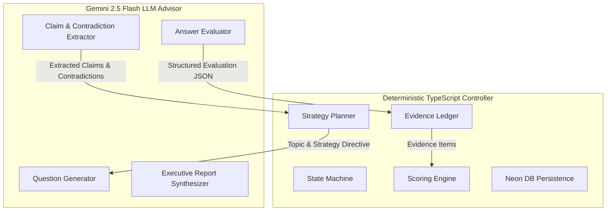
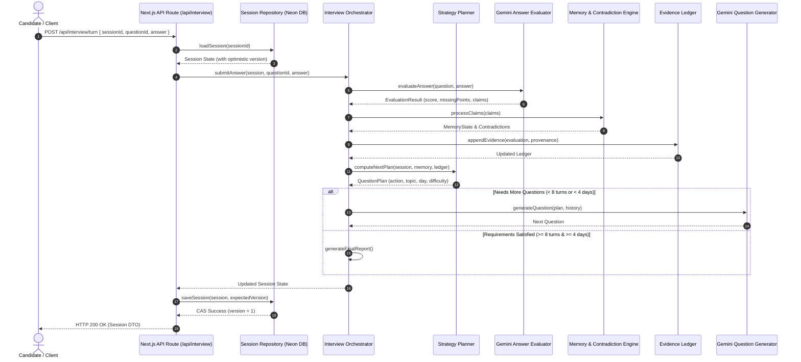

# InterviewOS — Deep Technical Architecture

InterviewOS is an autonomous, adaptive AI technical interviewer designed to conduct candidate-aware, context-sensitive technical evaluations while enforcing strict deterministic control over interview rules, lifecycle, scoring, and security boundaries.

---

## 🏛 1. Core Control Philosophy

### The Dual-Engine Pattern: *"LLM as Advisor, TypeScript as Controller"*

Traditional AI interview tools delegate complete control to an LLM, leading to unscripted conversation loops, lost curriculum constraints, and unexplainable numeric scores. InterviewOS enforces a strict architectural boundary:



1. **Deterministic TypeScript Engine**:
   - Manages state transitions (`active` → `completed`).
   - Enforces hard constraints (minimum 8 questions, minimum 4 unique curriculum days).
   - Manages topic candidate pools, difficulty escalation, and coverage rescue triggers.
   - Computes final 0–100 competency scores strictly from observed evidence.
   - Manages database persistence, optimistic concurrency (CAS), and idempotent turns.
2. **Gemini 2.5 Flash LLM Advisor**:
   - Synthesizes technical question phrasing matching planner topic and difficulty.
   - Evaluates candidate answers into structured Zod JSON representations.
   - Extracts key technical claims and analyzes cross-turn contradictions.
   - Generates natural language report feedback summaries.

---

## 🔄 2. End-to-End Turn Orchestration

### Turn Execution Sequence Diagram



---

## 🎯 3. Strategy Planner & Adaptive Decision Engine

The **Strategy Planner** (`src/lib/interview/question-planner.ts`) operates deterministically to select the topic, curriculum day, difficulty, and action type for every turn:

### Planner Action Selection Logic

1. **Initial Probe (Turn 1)**:
   - Evaluates candidate background priors (retries, skipped topics, project focus).
   - Selects an optimal starting topic and difficulty (e.g. `foundation` vs `advanced`).
2. **Follow-Up Decision Rules (Turns 2–7)**:
   - **`deepen`**: Triggered when the candidate scores high on previous turn (`score >= 3.0`) and demonstrates deep technical understanding. Escalates difficulty.
   - **`clarify`**: Triggered when answer score is partial (`1.5 <= score < 3.0`). Probes foundational concepts to verify core understanding.
   - **`challenge`**: Triggered when the Memory Engine flags a contradiction between claims made across separate turns.
   - **`rescue`**: Triggered when remaining turns are equal to or fewer than uncovered curriculum days needed to meet the 4-day minimum.
3. **Coverage Rescue Override**:
   - If an interview is on Turn 6 and has only covered 2 unique curriculum days, the planner forcefully overrides topic preference to target an uncovered curriculum day.

---

## 🧠 4. Cross-Turn Memory & Contradiction Detection

The **Memory Engine** (`src/lib/interview/interview-memory.ts`) maintains cross-turn state across the entire interview session:

1. **Claim Extraction**: Candidate answers are passed to Gemini 2.5 Flash to extract atomic technical assertions:
   ```json
   {
     "topic": "Embeddings Explained",
     "assertion": "Mean pooling preserves sentence-level semantics better than CLS extraction.",
     "confidence": 0.9
   }
   ```
2. **Same-Topic Claim Comparison**: Extracted claims are stored in session memory. When new claims are made on the same topic, the comparator evaluates consistency:
   - **Consistent**: Strengthens evidence confidence.
   - **Contradictory**: Flags a `ContradictionSignal` containing both claim IDs and triggers a `challenge` planner action on the next turn.

---

## 📊 5. Evidence Ledger & Deterministic Scoring Math

The **Evidence Ledger** (`src/lib/interview/evidence-ledger.ts`) collects evidence items across all turns:

### Evidence Item Schema
```typescript
interface EvidenceItem {
  id: string;
  questionId: string;
  turnId: number;
  competency: CompetencyDimension; // correctness | depth | communication | problemSolving | curriculumAlignment
  score: number;                   // 0.0 to 4.0
  confidence: number;              // 0.0 to 1.0
  difficultyWeight: number;        // foundation: 1.0, intermediate: 1.2, advanced: 1.5
  topics: string[];
}
```

### Numeric Scoring Algorithm (`src/lib/report/scoring-engine.ts`)
For each competency dimension $C$:
$$\text{RawScore}_C = \frac{\sum_{i \in E_C} (\text{score}_i \cdot \text{confidence}_i \cdot \text{difficultyWeight}_i)}{\sum_{i \in E_C} (\text{confidence}_i \cdot \text{difficultyWeight}_i)}$$

$$\text{NormalizedScore}_C = \text{Math.round}\left( \frac{\text{RawScore}_C}{4.0} \times 100 \right)$$

$$\text{OverallScore} = \text{Math.round}\left( \sum_{C} w_C \cdot \text{NormalizedScore}_C \right)$$

- Numeric scores (0–100) are derived **100% deterministically from observed evidence**.
- Scores are **uninflated** by candidate background priors.
- Competency level mapping:
  - `< 50`: `Unsatisfactory`
  - `50 – 64`: `Foundational`
  - `65 – 79`: `Proficient`
  - `80 – 89`: `Advanced`
  - `>= 90`: `Exceptional`

---

## 💾 6. Persistence & Optimistic Concurrency (CAS)

InterviewOS uses **Neon PostgreSQL** as its production persistence layer via `@neondatabase/serverless` HTTP driver (`src/lib/interview/postgres-session-repository.ts`):

### Database Schema (`database/schema.sql`)
```sql
CREATE TABLE IF NOT EXISTS interview_sessions (
  id VARCHAR(64) PRIMARY KEY,
  candidate_id VARCHAR(64) NOT NULL,
  status VARCHAR(32) NOT NULL DEFAULT 'active',
  version INT NOT NULL DEFAULT 1,
  questions_answered INT NOT NULL DEFAULT 0,
  unique_days_covered INT NOT NULL DEFAULT 0,
  covered_days INT[] NOT NULL DEFAULT '{}',
  covered_topics TEXT[] NOT NULL DEFAULT '{}',
  session_data JSONB NOT NULL,
  created_at TIMESTAMPTZ NOT NULL DEFAULT NOW(),
  updated_at TIMESTAMPTZ NOT NULL DEFAULT NOW()
);
```

### Optimistic Concurrency Control (CAS)
To prevent stale overwrites across concurrent requests in serverless environments, state updates execute via Compare-And-Swap parameterized SQL:
```sql
UPDATE interview_sessions 
SET session_data = $1, version = version + 1, updated_at = NOW()
WHERE id = $2 AND version = $3
RETURNING version;
```
If `version` does not match, the query returns 0 modified rows, throwing a safe `TURN_CONFLICT` error.

---

## 🛡 7. Security, Hardening & Error Resilience

1. **Opaque Session UUIDs**: Cryptographically random UUIDs (`crypto.randomUUID()`) hide candidate identity and preventing session enumeration.
2. **Production Debug Guard**: `guardDebugRoute()` intercepts all 13 `/api/debug/*` endpoints, returning HTTP **404** when `NODE_ENV === "production"`.
3. **Input Hardening**: Candidate answers are capped at **5,000 characters** in Zod API schemas and UI textareas.
4. **Security Headers**: Configured in `next.config.ts` (`nosniff`, `DENY`, `strict-origin-when-cross-origin`, `Permissions-Policy`).
5. **Deterministic Provider Fallbacks**: Fallback templates ensure question generation, evaluation, and report synthesis continue safely even if Gemini API key is missing or model calls time out.
